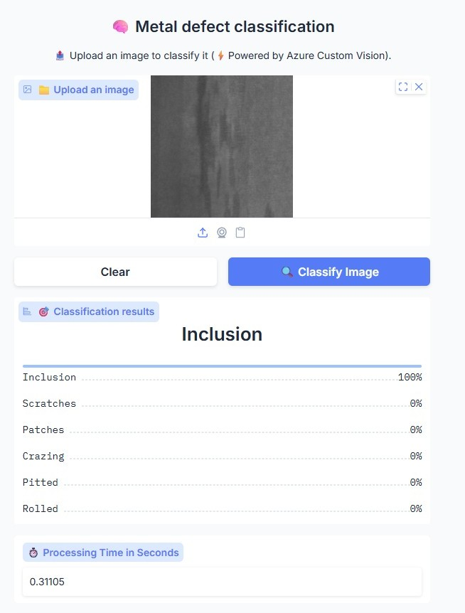
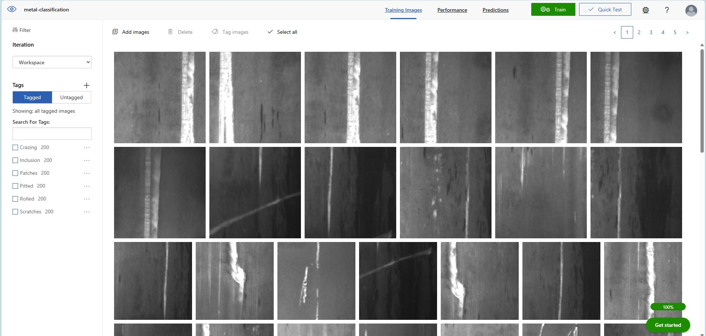
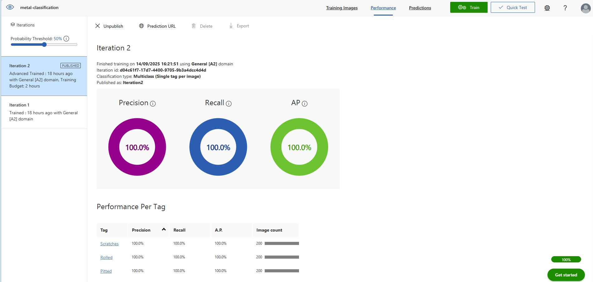
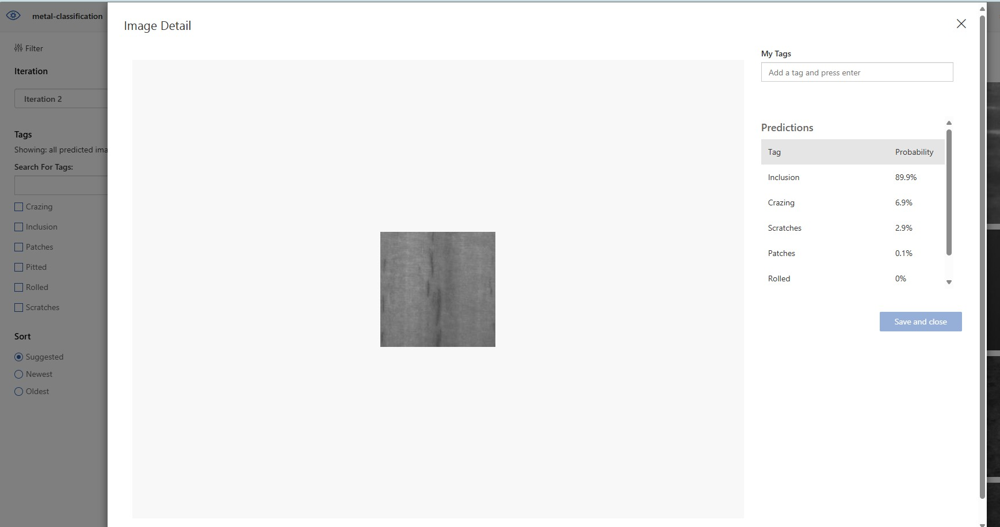

# Image Classification with Azure Custom Vision

This repository contains Python notebooks demonstrating how to build and deploy image classification models using Azure Custom Vision service. The project consists of two main components: model training and prediction inference.
<br><br>


## 📋 Overview

Azure Custom Vision is a Azure AI service that allows you to build custom image classifiers. 
This project provides end-to-end examples of:
- Training a custom image classification model
- Making predictions with the trained model
- Best practices for working with Azure Custom Vision API

## 🗂️ Repository Structure

The dataset contains metal images categorized into six classes of defects:
- Crazing
- Inclusion
- Patches
- Pitted
- Rolled
- Scratches

├── Image classification - Training - Azure Custom Vision.ipynb
├── Image classification - Prediction - Azure Custom Vision.ipynb
├── README.md
└── images/
    ├── train/
    │   ├── Crazing/
    │   ├── Inclusion/
    │   ├── Patches/
    │   ├── Pitted/
    │   ├── Rolled/
    │   └── Scratches/
    └── test/
        ├── Crazing/
        ├── Inclusion/
        ├── Patches/
        ├── Pitted/
        ├── Rolled/
        └── Scratches/
        
## 📓 Notebooks

### 1. Training Notebook
**File:** `Image classification - Training - Azure Custom Vision.ipynb`
<br><br>
https://github.com/retkowsky/image-classification-azure-custom-vision/blob/main/Image%20classification%20-%20Training%20-%20Azure%20Custom%20Vision.ipynb
<br><br>
This notebook covers:
- Setting up Azure Custom Vision training resources
- Uploading and tagging training images
- Configuring training parameters
- Training the custom vision model
- Evaluating model performance
- Publishing the trained model

### 2. Prediction Notebook  
**File:** `Image classification - Prediction - Azure Custom Vision.ipynb`
<br><br>
https://github.com/retkowsky/image-classification-azure-custom-vision/blob/main/Image%20classification%20-%20Prediction%20-%20Azure%20Custom%20Vision.ipynb
<br><br>
This notebook demonstrates:
- Setting up prediction resources
- Loading the trained model
- Making predictions on new images
- Processing and interpreting results
- Batch prediction workflows

## 🚀 Getting Started

### Prerequisites

1. **Azure Account**: You need an active Azure subscription
2. **Python Environment**: Python 3.7 or higher
3. **Required Libraries**: Install the dependencies listed below

### Azure Resources Setup

Before running the notebooks, create the following Azure resources:

1. **Custom Vision Training Resource**
   - Go to Azure Portal
   - Create a new "Custom Vision" resource
   - Choose "Training" as the kind
   - Note down the training key and endpoint

2. **Custom Vision Prediction Resource**  
   - Create another "Custom Vision" resource
   - Choose "Prediction" as the kind
   - Note down the prediction key, endpoint, and resource ID

### Installation

1. Clone this repository:
```bash
git clone https://github.com/retkowsky/image-classification-azure-custom-vision.git
cd image-classification-azure-custom-vision
```

2. Install required Python packages:
```bash
pip install azure-cognitiveservices-vision-customvision
pip install jupyter
pip install matplotlib
pip install pillow
pip install requests
```

### Configuration

Update the notebook configuration cells with your Azure Custom Vision credentials:

```python
# Training configuration
TRAINING_KEY = "your-training-key"
TRAINING_ENDPOINT = "your-training-endpoint"

# Prediction configuration  
PREDICTION_KEY = "your-prediction-key"
PREDICTION_ENDPOINT = "your-prediction-endpoint"
PREDICTION_RESOURCE_ID = "your-prediction-resource-id"
```

## 🔧 Usage

### Training Your Model

1. Open `Image classification - Training - Azure Custom Vision.ipynb`
2. Update the configuration with your Azure credentials
3. Prepare your training dataset (images organized by categories)
4. Run the notebook cells to:
   - Create a new project
   - Upload and tag images
   - Train the model
   - Evaluate performance

### Making Predictions

1. Open `Image classification - Prediction - Azure Custom Vision.ipynb`  
2. Update the configuration with your prediction credentials
3. Run the notebook to:
   - Connect to your trained model
   - Upload test images
   - Get classification predictions
   - Visualize results

## 📊 Model Performance

The notebooks include sections for:
- **Precision and Recall**: Per-class performance metrics
- **Confidence Scores**: Prediction confidence levels
- **Confusion Matrix**: Classification accuracy visualization
- **Performance Iteration**: Comparing different training iterations

## 🎯 Use Cases

This project template can be adapted for various image classification scenarios:
- **Product Categorization**: Classify products in e-commerce
- **Quality Control**: Detect defects in manufacturing
- **Medical Imaging**: Classify medical scan types
- **Wildlife Monitoring**: Identify animal species
- **Document Classification**: Categorize document types

## ⚙️ Advanced Configuration

### Custom Training Parameters

You can customize training parameters such as:
- **Training Type**: Fast vs Advanced training
- **Domain**: General, Food, Landmarks, Retail, etc.
- **Negative Image Tag**: For images that don't belong to any category

### Batch Operations

The notebooks support:
- **Bulk Image Upload**: Upload multiple images at once  
- **Batch Prediction**: Process multiple images simultaneously
- **Export Models**: Download models for offline use

## 🛠️ Troubleshooting

### Common Issues

1. **Authentication Errors**: Verify your keys and endpoints are correct
2. **Quota Limits**: Check your Azure subscription limits
3. **Image Format**: Ensure images are in supported formats (JPG, PNG, GIF, BMP)
4. **Image Size**: Images should be larger than 256x256 pixels

### Best Practices

- **Training Data**: Use at least 50 images per class for better accuracy
- **Image Quality**: Use high-quality, representative images
- **Balanced Dataset**: Ensure roughly equal numbers of images per class
- **Regular Retraining**: Update models with new data periodically

## 📚 Additional Resources

- [Azure Custom Vision Documentation](https://docs.microsoft.com/en-us/azure/cognitive-services/custom-vision-service/)
- [Custom Vision Python SDK Reference](https://docs.microsoft.com/en-us/python/api/overview/azure/cognitiveservices-vision-customvision-readme)
- [Azure Cognitive Services Pricing](https://azure.microsoft.com/en-us/pricing/details/cognitive-services/custom-vision-service/)

## 📄 License

This project is provided as educational material. Please ensure compliance with Azure's terms of service when using these resources.

## 👨‍💻 Author

**Serge Retkowsky**
- GitHub: [@retkowsky](https://github.com/retkowsky)
- Microsoft

## ⚠️ Disclaimer

These notebooks are designed for demonstration and learning purposes. For production usage, consider additional security, error handling, and scalability requirements.

## Images and tags


## Model results


## Predictions



*Last updated: 16 September 2025*
